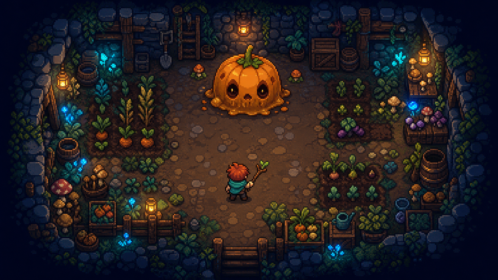

# 《月根秘境》美术与 UI 规范

版本：视觉方向 v0.1

---

## 1. 视觉关键词

温暖、手作、潮湿泥土、木制工具、月光植物、可爱但不幼稚、神秘但不恐怖。

整体采用原创 16-bit 像素语言。画面可以借鉴经典农场像素游戏的亲切感，但不复刻其人物比例、头像结构、物件造型、字体或 UI 边框。

方向稿用于确定以下内容：

- 深蓝暗部与暖橙灯光的主对比。
- 石室、土壤、木架和植物共同组成的“地下农庄”。
- 高三分之二俯视角的房间构图。
- 圆润、有清晰表情的非恐怖怪物。

正式资产不直接从方向稿裁切，统一按下述像素规格重新绘制。

---

## 2. 像素规格

| 项目 | 规范 |
|---|---|
| 设计分辨率 | 320 × 180 或 480 × 270，整数倍缩放至窗口 |
| 地块网格 | 16 × 16 px |
| 主角占用 | 碰撞约 12 × 12 px，绘制约 20 × 28 px |
| 普通敌人 | 16 × 16 至 32 × 32 px |
| Boss | 48 × 48 至 80 × 80 px |
| UI 图标 | 8、12、16、24 px 四档 |
| 描边 | 1 px 主描边；大型单位局部 2 px 暗边 |
| 缩放 | 仅使用整数倍和 nearest-neighbor |

### 2.1 像素绘制规则

- 不使用旋转后产生的半透明边缘；八方向武器需要单独绘制或有限角度贴图。
- 阴影使用色块和抖动，不使用模糊滤镜。
- 单个普通角色的主色不超过 8–12 个，避免局部噪点。
- 交互物轮廓比纯装饰更完整、更亮。
- 地面纹理密度低于单位纹理，确保战斗信息优先。

---

## 3. 色彩系统

### 3.1 核心色板

| 用途 | 色值 | 说明 |
|---|---|---|
| 最深背景 | `#0E1628` | 屏幕边缘、深洞、最暗描边 |
| 深蓝石 | `#1D2D44` | 墙体暗面 |
| 月影蓝 | `#2F5572` | 冷光中间色 |
| 苔藓绿 | `#496B3B` | 环境植物 |
| 嫩芽绿 | `#88B84B` | 可交互植物高光 |
| 土壤棕 | `#6B4632` | 可种植地 |
| 木材棕 | `#9A6139` | UI 框与场景木件 |
| 蜂蜜金 | `#E6A84A` | 奖励、灯光、重要交互 |
| 南瓜橙 | `#D96832` | 敌人警示与首区 Boss |
| 生命红 | `#C84C4C` | 生命与受伤反馈 |
| 月露青 | `#3BC6C4` | 魔法、稀有资源、友方弹道 |
| 羊皮白 | `#F3DEB3` | 主文本与高亮边缘 |

### 3.2 阵营可读性

- 友方攻击：青绿核心 + 白色高光，轨迹圆润。
- 敌方攻击：橙红核心 + 深色外轮廓，轨迹尖锐或脉冲。
- 治疗与增益：嫩绿 + 金色星点。
- 腐化与诅咒：紫红 + 断续方块粒子。
- 不仅依赖色相；弹体轮廓和运动方式必须同时区分阵营。

---

## 4. 角色设计

### 4.1 主角“莱芽”

轮廓：蓬松红棕短发、青绿色围巾、深色背带裤、短木杖。  
识别点：围巾在移动中形成清晰方向感；杖头是一枚两叶嫩芽。  
比例：头部约占全高 40%，手脚简化但动作夸张。  
性格：好奇、专注、面对巨大怪物也更像照料麻烦作物，而非猎杀。

基础动画预算：

| 动画 | 方向 | 帧数建议 |
|---|---:|---:|
| 待机 | 4 | 4 |
| 行走 | 4 | 6 |
| 主攻击 | 8 | 4–6 |
| 种子技 | 4 | 6 |
| 翻滚 | 4 | 6 |
| 受伤 | 4 | 2–3 |
| 倒地/恢复 | 1 | 8 |
| 互动/收割 | 4 | 6 |

### 4.2 动画性格

- 待机时角色会轻扶围巾或观察杖头嫩芽。
- 移动使用轻微上下弹跳，但头部不应过度晃动。
- 攻击强调“挥、点、播”，避免现代枪械后坐力语言。
- 受伤用短促挤压和白色闪帧，不使用血液。

---

## 5. 怪物设计语言

怪物遵循“熟悉的农庄事物 + 一处月光变异”。基础形状负责说明行为：

- 圆形：缓慢、可爱、可接近。
- 三角或尖刺：远程、危险、攻击方向明确。
- 宽扁形：阻挡、冲撞、占据空间。
- 高瘦形：施法、召唤、改变地块。

每种怪物需要：待机、移动、攻击前摇、攻击、受击、消失六类状态。攻击前摇至少持续 8–18 帧，并通过姿态与亮度同步提示。

怪物消失统一表现为：身体缩成种子或散成叶片；精英可留下短暂月光剪影。

### 5.1 Boss 规格

- Boss 轮廓应在纯黑剪影下依然可识别。
- 核心弱点使用稳定亮色，不与普通受击闪光混淆。
- 每阶段只新增一个主要视觉规则。
- 大型弹幕预警先出现地面像素纹或边缘闪动，再出现伤害判定。

---

## 6. 场景与地块

### 6.1 图层顺序

地面底色 → 地面纹理 → 状态覆盖 → 低矮装饰 → 单位与投射物 → 高层遮挡 → 粒子与光照 → UI。

### 6.2 场景密度

- 战斗区域中央保持低纹理密度。
- 房间边缘可使用木架、桶、花盆、工具和藤蔓叙事。
- 可破坏物带一圈偏暖描边；纯背景物降低 15%–25% 对比度。
- 高层遮挡在玩家进入其后方时降至 35% 不透明度。

### 6.3 土地状态表现

| 状态 | 底色 | 轮廓/纹理 | 动画 |
|---|---|---|---|
| 普通 | 中棕 | 稀疏小石与土块 | 无 |
| 湿润 | 深棕偏蓝 | 小片镜面高光 | 低频闪点 |
| 肥沃 | 暖深棕 | 叶屑与圆点 | 偶尔冒出小芽 |
| 月照 | 蓝紫 | 方形月纹 | 缓慢向上粒子 |
| 腐化 | 紫黑 | 锯齿裂纹 | 向内收缩脉冲 |

---

## 7. 特效与反馈

### 7.1 命中层级

- 轻击：1 帧白闪 + 2–3 个像素碎片。
- 重击：2 帧白闪 + 轻微停顿 + 4–6 个方向性碎片。
- 暴击/成熟收割：金色十字闪光 + 环形叶片 + 更明显音高提示。
- 玩家受伤：红白闪烁、0.15 秒轻震、生命 UI 抖动。

屏幕震动不能代替动画反馈，默认强度克制，并提供 0%–100% 设置。

### 7.2 生长表现

植物成长分为种子、嫩芽、半熟、成熟四个清晰剪影；临近成熟时使用 2 帧亮边循环。成熟完成应有短促的“弹开”动画，让玩家余光也能识别。

### 7.3 光照

光照用于氛围和引导，不参与主要判定。玩家、出口、奖励和危险前摇在没有动态光照时仍必须清楚。

---

## 8. UI 风格

### 8.1 视觉语言

- 木质或深蓝石质外框，内层使用羊皮纸或深色半透明底。
- 四角有 1–2 px 金色铆钉或叶片，不使用复杂花边。
- 选中态用蜂蜜金描边和轻微上浮，不只改变颜色。
- UI 动画以 80–160ms 的像素级位移为主，避免现代玻璃拟态。

### 8.2 字体

- 标题：原创或可商用的方块像素字，笔画厚、重心稳。
- 正文：优先使用高可读中文点阵字体；最小显示高度不低于 12 px 设计像素等效值。
- 数字：固定宽度，避免资源变化时 UI 跳动。
- 字体、图标与边框必须确认商用授权并记录来源。

### 8.3 战斗 HUD 布局

| 区域 | 信息 |
|---|---|
| 左上 | 生命、临时护盾、角色状态 |
| 上中 | 房间波次或 Boss 名称与生命条 |
| 右上 | 月露、种荚、季叶 |
| 左下 | 主工具图标、当前强化与冷却 |
| 右下 | 主种子、主动技能、翻滚冷却 |
| 屏幕边缘 | 仅在必要时显示敌人/出口方向提示 |

平时 HUD 只保留核心信息；详细数值在暂停页查看。

### 8.4 构筑选择界面

三选一奖励卡由图标、名称、一句机制说明、关键数值和标签组成。推荐结构：

> **雨后豆荚**  
> 湿润地上的豆弹会额外弹射 1 次。  
> 标签：豌豆 / 湿润 / 连锁

必须避免只写“显著提高”“小幅提升”等模糊描述，玩家应能看到实际数值。

### 8.5 地图

使用根系节点表示房间连接。未探索房间仅显示类型线索，不显示全部奖励。当前路径用嫩芽绿，已错过分支逐渐变暗。

---

## 9. 菜单与关键流程

### 9.1 标题页

背景为地下农庄方向稿或对应的循环场景动画；中央保留标题和主按钮区域。菜单顺序：继续、开始新旅程、图鉴、设置、制作名单、退出。

### 9.2 暂停页

默认打开“本局构筑”，展示当前工具、种子、遗物和土地配方。第二页为地图，第三页为设置。避免玩家为查看构筑反复退出暂停页。

### 9.3 结算页

先显示本局最具代表性的三项成果，再展开统计。失败语气保持鼓励，但不使用夸张庆祝；胜利时展示本局战场逐渐长成一小片花园。

---

## 10. 音频方向

虽然不属于视觉资产，但音画需要共同定义质感：

- 音乐以木琴、拨弦、手鼓、柔和合成器为主。
- 普通攻击短、脆、偏木质；成熟收割声音明亮、有层次。
- 受击与危险警告占据不同频段，避免弹幕密集时混淆。
- 环境音包含滴水、虫鸣、木架轻响和远处根系生长声。
- 低生命状态不持续播放刺耳警报，仅在生命变化与进入房间时提示。

---

## 11. 美术交付清单

原型阶段优先级：

1. 主角完整基础动画。
2. 3 种种子与四阶段生长动画。
3. 6 种普通敌人、1 个 Boss。
4. 首区 16 px 图块集与 12 个房间装饰组合。
5. 战斗 HUD、三选一卡片、暂停与结算界面。
6. 命中、受伤、成熟、收割、房间清除五套关键特效。
7. 16 个通用图标和 12 个遗物图标。

每个资产需附：像素尺寸、锚点、碰撞参考、动画帧率、色板索引和导出命名。

### 11.1 命名建议

- `chr_laiya_walk_down_01`
- `enm_sprout_attack_left_03`
- `seed_pea_mature_02`
- `tile_cellar_soil_wet_01`
- `ui_relic_rainpod_24`
- `fx_harvest_gold_01`
